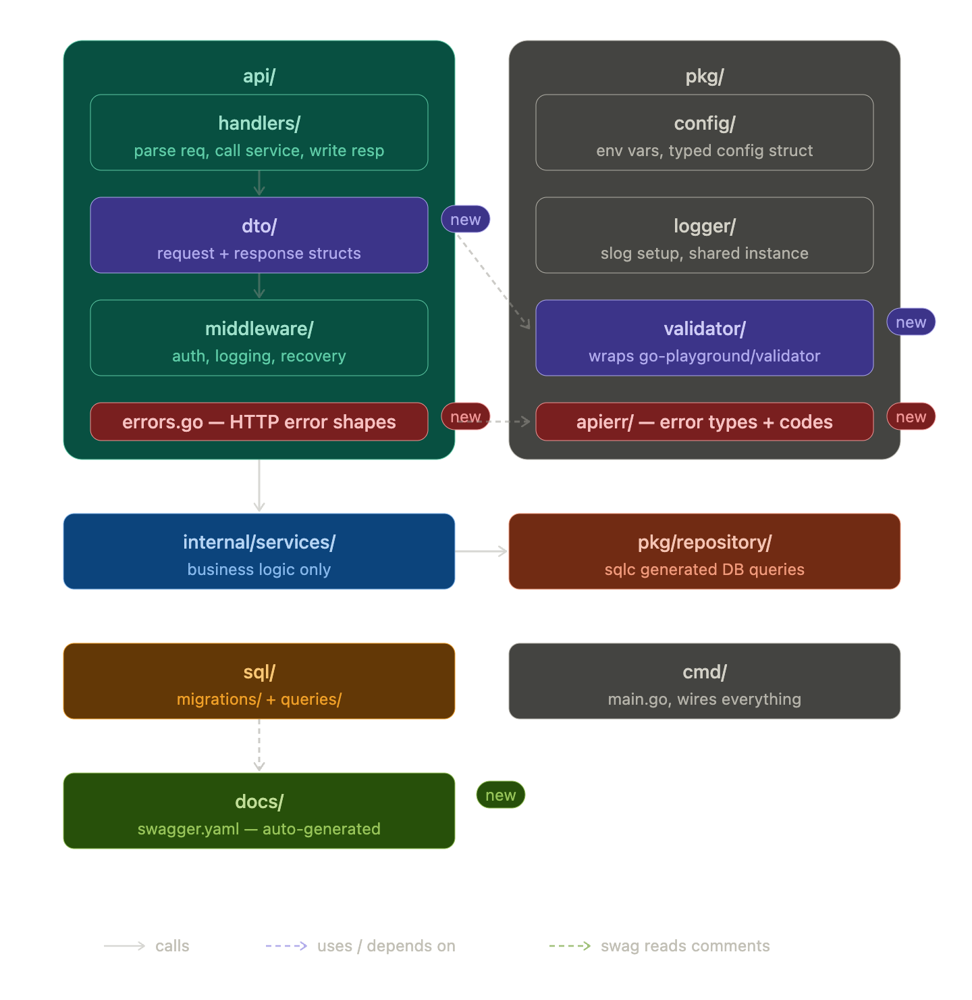

Good catch! Let me show you where these fit.Good question — these are easy to forget but important to get right early. Here's where everything lives:Here's the breakdown of each new piece:

---



**`api/dto/`** — Your request/response structs (DTOs) live here, right next to the handlers that use them. Example:

```go
// api/dto/user.go
type CreateUserRequest struct {
    Name  string `json:"name"  validate:"required,min=2"`
    Email string `json:"email" validate:"required,email"`
}

type UserResponse struct {
    ID    string `json:"id"`
    Name  string `json:"name"`
    Email string `json:"email"`
}
```

The `validate` tags are read by `go-playground/validator`. The `json` tags double as swagger field docs when you add swag comments above.

---

**`pkg/validator/`** — A thin wrapper that initializes the validator once and exposes a `Validate(v any) error` helper. Handlers call this after binding the request body. Keeps the validator setup out of every handler.

---

**`api/errors.go`** — The HTTP error response shape. One consistent struct for every error your API returns:

```go
type ErrorResponse struct {
    Code    string `json:"code"`
    Message string `json:"message"`
}
```

---

**`pkg/apierr/`** — Typed sentinel errors with codes (`ErrNotFound`, `ErrUnauthorized`, etc.). Your services return these, and your handlers map them to the right HTTP status + `ErrorResponse`. This is the bridge between "business error" and "HTTP error."

---

**`docs/`** — Swagger lives here, but you never write it manually. You use [swaggo/swag](https://github.com/swaggo/swag): add comments above your handlers and run `swag init` — it generates `docs/swagger.yaml` and `docs/swagger.json` automatically. The comments reference your DTOs, which is why DTOs and handlers live close together in `api/`.

---

Your updated structure should look like:

```
api/
├── handlers/
├── dto/          ← new
├── middleware/
└── errors.go     ← new

pkg/
├── apierr/       ← new
├── validator/    ← new
├── config/
├── logger/
└── repository/

docs/             ← new (swag generates this)
```


# Running migration

- goose -dir internal/db/migrations postgres "$DB_URL" up

# Running lint

- golangci-lint run --fix